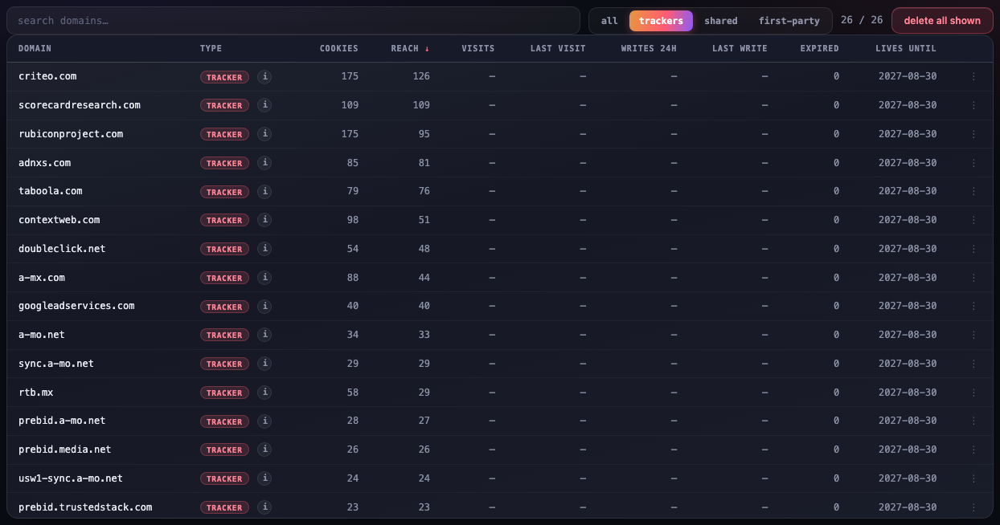

# Field report: what one real browser was carrying

This is not a hypothetical. This is the actual tracker inventory of one real Chrome profile —
a normal person browsing news, travel, shopping, and finance sites — read straight from
Chrome's own cookie store in July 2026. The sites visited are redacted (that's the person's
browsing history, and protecting it is the whole point). The trackers are named, because
naming them is *also* the point.

**"Seen inside N sites"** means: this domain's cookies were planted while the person was on
N *different* websites. The person never visited the tracker itself. Not once.

*The Explore view over this profile's tracker footprint (reconstructed in a clean browser
from the real per-tracker counts, so no personal browsing data appears in the image).*

## The totals

| | |
|---|---:|
| Cookies stored | **4,916** |
| Distinct domains holding cookies | **799** |
| Cookies flagged `SameSite=None` (sendable cross-site) | **2,982** — 61% |
| Cookies set to live more than a year | **929** |
| Cross-site trackers (reach ≥ 5 sites) | **28** |

## The worst of the worst

| # | Domain | Who it actually is | Cookies | Seen inside |
|--:|---|---|--:|--:|
| 1 | criteo.com | Criteo — retargeting ("that product follows you around") | 186 | **126 sites** |
| 2 | scorecardresearch.com | Comscore — audience measurement | 109 | **109 sites** |
| 3 | rubiconproject.com | Magnite — the largest independent sell-side ad exchange | 238 | 95 sites |
| 4 | adnxs.com | Xandr (Microsoft) — ad exchange | 85 | 81 sites |
| 5 | taboola.com | Taboola — "Around the Web" chumboxes | 79 | 76 sites |
| 6 | youtube.com | Google — video embeds carrying ad-personalization cookies | 273 | 66 sites |
| 7 | contextweb.com | PulsePoint — health/pharma-focused ad exchange | 98 | 51 sites |
| 8 | doubleclick.net | Google — the single most widespread ad tracker on the web | 54 | 48 sites |
| 9 | a-mx.com | RTB cookie-sync infrastructure | 88 | 44 sites |
| 10 | googleadservices.com | Google Ads conversion tracking | 40 | 40 sites |
| 11 | a-mo.net (+ sync., prebid., usw1-sync. subdomains) | RTB cookie-sync mesh — four coordinated endpoints | 115 | 33 sites |
| 12 | google.com | Google — NID ad-personalization ID | 56 | 33 sites |
| 13 | rtb.mx | RTB cookie-sync infrastructure | 58 | 29 sites |
| 14 | prebid.media.net | Media.net — header-bidding ID sync | 26 | 26 sites |
| 15 | amx1.net (+ cs. subdomain) | Ad-tech ID sync, two coordinated endpoints | 42 | 21 sites |
| 16 | prebid.trustedstack.com | Header-bidding ID sync | 23 | 23 sites |
| 17 | dotomi.com | Epsilon/Conversant (Publicis) — retargeting tied to offline purchase data | 32 | 15 sites |
| 18 | casalemedia.com | Index Exchange — major ad exchange | 17 | 15 sites |
| 19 | ingage.tech | Ad tech | 11 | 11 sites |
| 20 | trinitymedia.ai | Trinity Audio — text-to-speech widget with tracking | 10 | 10 sites |
| 21 | smartadserver.com | Equativ — European ad exchange | 9 | 7 sites |
| 22 | yandex.ru | Yandex — Russian search/ad giant | 12 | 6 sites |
| 23 | userreport.com | AudienceProject — audience measurement | 6 | 6 sites |
| 24 | mpsnare.iesnare.com | iovation (TransUnion) — **device fingerprinting owned by a credit bureau** | 6 | 6 sites |

## What jumps out

- **Comscore is a census.** 109 cookies across 109 sites — exactly one per site. Its entire
  job is counting you, everywhere, like a meter that follows you between buildings.
- **Criteo has the widest reach**: inside 126 different sites this person visited. One
  company, one persistent ID, 126 windows into one person's life.
- **The cookie-sync mesh is real.** a-mo.net alone runs four coordinated subdomains
  (`sync.`, `prebid.`, `usw1-sync.`) whose only purpose is matching this person's ID
  between ad companies — so that what one tracker knows, the others can buy.
- **A credit bureau is fingerprinting the browser.** `mpsnare.iesnare.com` is iovation,
  TransUnion's "device reputation" product. Six sites quietly loaded it.
- **61% of everything stored is cross-site capable** (`SameSite=None`) — flagged by the
  ad tech itself as intended to travel between sites.
- **929 cookies are set to outlive a year** — some are set to 2038. They are not planning
  to forget you.

## Reproduce this on your own browser

Install Cookie Commander (see [README](README.md)), open the dashboard, hit the
**trackers** filter in Explore. Your numbers will be different. They will not be better.

Then hit **Block all current trackers**. That part takes one click.
